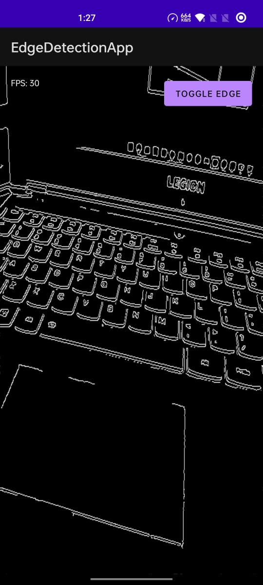

#  Edge Detection-OpenGL

### **Overview** 

This project is a dynamic Android app that captures real-time camera frames, processes them using **OpenCV** in C++ via **JNI**, and displays the processed output using **OpenGL ES 2.0**. It even includes a **Web Viewer** to stream processed frames over **WebSocket** for remote display.


## **💻 Tech Stack**

-   **Android App**:
    
    -   **Kotlin**: For Android app development and camera handling.
        
    -   **JNI**: For integrating OpenCV’s C++ code.
        
    -   **OpenGL ES 2.0**: For real-time graphics rendering.
        
    -   **WebSocket**: For live frame streaming to the web viewer.
        
-   **Web Viewer**:
    
    -   **HTML** + **TypeScript**: The frontend code to display frames in a web browser.
        
    -   **WebSocket**: For live communication between the Android device and the web client.
        
-   **C++ with OpenCV**: Image processing via OpenCV (grayscale conversion and Canny edge detection) in **NativeLib.cpp**.

## **🎨 Features Implemented**

#### **Android App** 📲

-   **Camera Feed Capture**: Using the **Camera2 API**, it captures high-quality video frames from the device camera.
    
-   **OpenCV Processing (via JNI)**:
    
    -   **Grayscale Conversion** 
        
    -   **Canny Edge Detection**
        
-   **OpenGL ES 2.0 Rendering**: Real-time rendering of the processed frame with smooth OpenGL graphics.
    
-   **Toggle Button**: Easily switch between the raw camera feed and the edge-detected output for visual comparison.
    
-   **FPS Counter**: Displays the real-time frame rate, showing how quickly the device is processing and rendering frames. 
    

#### **Web Viewer** 🌐

-   **WebSocket Communication**: Connects to the Android app to stream the processed frames in real time.
    
-   **Base64-Encoded Image**: The processed frame is encoded and displayed as a base64 image in a modern web browser. 🔗🌍
    


## **🚀 How It Works**

1.  **Capture Camera Feed** 📸: The app uses the **Camera2 API** to access the device's camera and capture video frames.
    
2.  **Process via OpenCV (C++)** ⚙️: The captured frames are sent to the **NativeLib.cpp** file via **JNI** for processing (grayscale or edge detection).
    
3.  **Return Processed Frame** 🔄: Once processed, the frame is sent back to the Android app.
    
4.  **Real-Time Rendering with OpenGL** 🖥️: The processed frame is rendered on the screen using **OpenGL ES 2.0** for smooth and efficient display.
    
5.  **WebSocket Streaming** 🌐: The processed frame is then streamed over **WebSocket** to the **web viewer** where it’s displayed live in a web browser.
    


    

----------
# 📸 Screenshots




### **📂 Architecture & Folder Structure**

```
/app
 ├── java/
      ├── MainActivity.kt   						# Camera feed, GLSurfaceView setup
      └── GLRenderer.kt     						# Renderer
	  └── FrameWebSocketServer.kt     				# Web Server
 ├── cpp/
      └── NativeLib.cpp     						# OpenCV processing logic via JNI
/web
 ├── index.html             						# Web viewer page (HTML)
 └── main.ts                						# TypeScript WebSocket client

```

----------

### **⚙️ Setup Instructions**

#### **Android** 🖥️

1.  **Install Android Studio** (with NDK and CMake support).
    
2.  Clone this repository and open it in **Android Studio**.
    
3.  Sync Gradle to ensure the **NDK**/C++ toolchain is detected.
    
4.  Build and run on a device (minimum API 24).
    
5.  **Grant camera permissions** when prompted to access the camera.
    

#### **Web** 🌐

1.  Open **web/index.html** in any modern browser.
    
2.  Ensure both the Android device and the web machine are on the **same network**.
    
3.  In **main.ts**, update the WebSocket IP to match the Android device's IP:
    
    ```js
    const ws = new WebSocket("ws://<ANDROID_IP>:8080");
    
    ```
    

    


    


